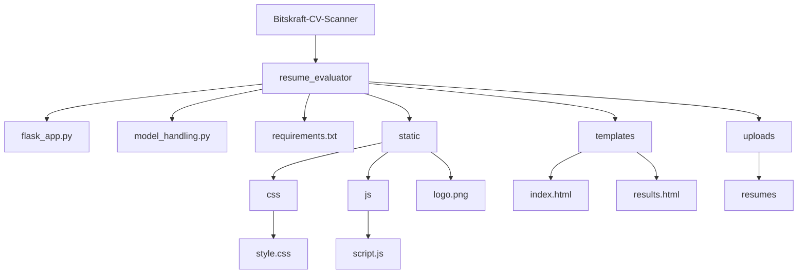

# Bitskraft-CV-Scanner
AI cv Scanner for Hiring Managers

resume_evaluator/

│

├── flask_app.py                     # Flask backend

├── model_handling.py                # AI logic (from earlier)

├── requirements.txt

│

├── static/

│   ├── css/

│   │   └── style.css              # Custom styling

│   ├── js/

│   │   └── script.js              # Interactive behavior

│   └── logo.png                   # bitskraft.com logo

│

├── templates/

│   ├── index.html                 # Main page

│   └── results.html               # Results page

│

└── uploads/

   └── resumes/                   # Temp storage (optional)

# Files and Folder Hierarchy

