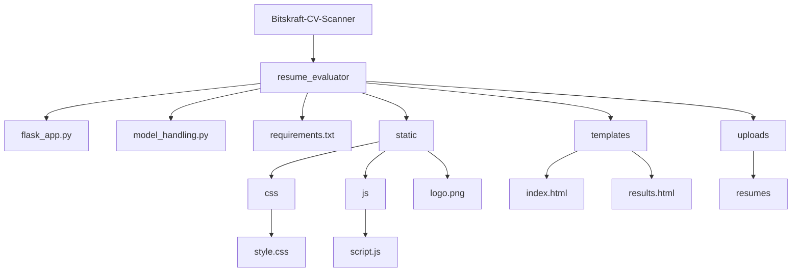

# Bitskraft-CV-Scanner
AI cv Scanner for Hiring Managers

resume_evaluator/

│

├── flask_app.py                     # Flask backend

├── model_handling.py                # AI logic (from earlier)

├── requirements.txt

│

├── static/

│   ├── css/

│   │   └── style.css              # Custom styling

│   ├── js/

│   │   └── script.js              # Interactive behavior

│   └── logo.png                   # bitskraft.com logo

│

├── templates/

│   ├── index.html                 # Main page

│   └── results.html               # Results page

│

└── uploads/

   └── resumes/                   # Temp storage (optional)

# Files and Folder Hierarchy

# 🛠️ Pre-requisites
   - Python 3.8 or higher
   
   - pip(python package installer)
   
   - Web browser(Chrome,Edge,Safari, etc.)

# ⚡ How to start
  1. Clone the Repository
     
     git clone https://github.com/yourusername/Bitskraft-CV-Scanner.git
     
     cd BitsKraft-CV-Scanner

  
  2. Set Up Virtual Environment(Recommended)
  
  
  3. Install Dependencies

     cd resume_evaluator

     pip install -r requirements.txt

  4. Run the Application

     python flask_app.py

  The application will be available at http://localhost:8500

  # 📋 Usage

    1.Access the Application: Open your web browser and navigate to http://localhost:8500
    2.Upload Resume: Click the upload button and select CV files (PDF, DOCX Supported)
    3.Configure Parameters: Set evaluation criteria and preferences
    4.Start Analysis: Click "Analyze" to begin the AI evaluation process
    5.View Results: Review comprehensive analysis reports and scores
    6.Export Reports: Download detailed evaluation reports and record-keeping

  # 🔧 Configuaration

   Environment Variables

    Create .env file in the resume_evaluator directory:
    

  # Model Configuration

     Customize AI evaluation parameters in model_handling.py :

      - Scoring weights
      - Evaluation criteria
      - Industry-specific requirements
      - Language processing settings

  # 📊 Evaluation Criteria

     The AI scanner uses a dual-approach evaluation system based on job requirements you  specify:

     Scoring Methodology

        - Semantic Matching(60%): Advanced AI understanding of context, skills, and experience relevance

        - Keyword Matching(40%): Direct matching of specified job requirements and technical terms

        Evaluation Process

         1.Requirements Input: Enter your specific job requirements, skills and qualifications
         2.Semantic Analysis: AI analyzes the contextual relevance and depth of candidate experience
         3.Keyword Detections: System identifies exact matches for required technical skills and qualifications
         4.Weighted Scoring: Combines both approaches with 60-40 weighting for comprehensive evaluation
         5.Final Score: Generates overall compatibility score with detailed breakdown

         What Gets Evaluated

           - Technical Skills Relevance: How well candidate skills align with job requirements
           - Experience Context: Quality and relevance of work experience (semantic understanding)
           - Requirement Fulfillment: Direct matches for must-have qualifications
           - Skill Depth: AI assessment of expertise level in required areas
           - Industry Alignment: Contextual understanding of industry-specific experience

           
  # 🔒 Security & Privacy

       - All uploaded files are processed locally
       - Temporary files are automatically cleaned up
       - No personal data is stored permanently
       - Secure file handling protocols implemented
       
  # 🚧 Development

      Adding New Features

       1.Fork the repository
       2.Create a feature branch (git checkout -b feature/new-feature)
       3.Make your changes
       4.Add tests if applicable
       5.Commit your changes (git commit -am 'Add new feature')
       6.Push to the branch (git push origin feature/new-feature)
       7.Create a Pull Request

 # Running tests

 # 📦 Dependencies

      Key dependencies include:

        - Flask: Web framework
        - PyPDF2/pdfplumber: PDF processing
        - python-docx: Word document handling
        - scikit-learn: Machine learning algorithms
        - nltk/spacy: Natural language processing
        - pandas: Data manipulation
        - numpy: Numerical computing
      See requirements.txt for complete list.

 # 🐛 Troubleshooting

       Common Issues

       1.File upload Fails

         - Check file size limits (default: 16MB)
         - Ensure supported file format (PDF, DOC, DOCX)
         - Verify upload directory permissions

      2.Analysis not Starting

        - Check AI model dependencies are installed
        - Verify sufficient system memory
        - Review error logs in console

      3.Performance Issues

        - Consider upgrading hardware for large batch processing
        - Optimize model parameters for your use case
        - Check available disk space

   # 📈 Performance

         - Processing Speed: ~2-5 seconds per resume
         - Batch Capacity: Up to 50 resumes simultaneously
         - Accuracy Rate: 85-95% depending on resume quality
         - Supported Formats: PDF, DOC, DOCX
         - Languages: English (primary), expandable

  
   # 🤝 Contributing

       We welcome contributions! Please see our Contributing Guidelines for details on:

         - Code style and standards
         - Pull request process
         - Issue reporting
         - Development setup

  # 👥 Team

          Bitskraft Development Team
             - Bijaya Thebe
             - Kushal Sharma
             - Najib Thapa
             - Anugaya Shah

          Visit us at bitskraft.com
          Contact: contact@bitskraft.com

  # 🙏 Acknowledgments

           - Open-source ML libraries and frameworks
           - Resume parsing algorithms research

  # 📞 Support

           For support and questions
           -

Made by the Bitskraft Team
  

