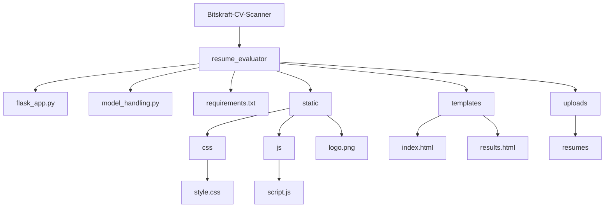

# 📘 User Manual for CV Parsing & Shortlisting System (Bitskraft-CV-Scanner)

## 1. Introduction
The Bitskraft-CV-Scanner is a web-based application designed to help hiring managers and recruiters automatically parse, analyze, and shortlist resumes based on their relevance to a job description. Key features include:

   -  Uploading resumes in PDF or DOCX format
   -  Extracting and cleaning text, optionally via OCR for scanned documents
   -  Computing semantic relevance versus a provided job description using embeddings
   -  Matching important keywords from the job description to the resume
   -  Producing an overall match score, summary (e.g. “Strong Match”, “Needs Improvement”), and list of matched keywords
   -  Providing a simple web interface (via Streamlit or Flask) for uploading, viewing results, and managing shortlists
   -  Sending email notifications to shortlisted candidates directly through Outlook (win32 client).

---

## 2. Architecture & File Structure
Here’s a breakdown of the main directories and files in the GitHub repo, and their responsibilities:

---

## 3. How It Works (User Workflow & Processing Flow)
Here’s a typical flow from uploading a resume to obtaining a shortlist or match score:

### a. User Uploads Resume & Enters Job Description
Through the web interface (Flask or Streamlit), the user uploads one or more resumes and provides a job description text.

### b. Text Extraction
- If the resume is text-based (PDF / DOCX), extract text directly.
- If it’s a scanned PDF (no embedded text), apply OCR to extract readable content.
 
### c. Preprocessing
Clean the extracted text: normalize whitespace, remove punctuation, lowercasing, etc.

### d. Keyword Extraction from Job Description
Extract important terms/technologies/skills from the job description. This may include tech keywords, proper nouns, etc.

### e. Semantic Similarity Calculation
Compute embeddings for both the resume text and the job description. Use a SentenceTransformer (or similar) model to measure semantic similarity.

### f. Keyword Matching & Scoring
Check which of the extracted keywords are present in the resume text. Combine this with the semantic similarity to compute an overall match score.

### g. Result Generation
Produce a summary of the candidate’s resume with:
- Overall match score
- Semantic relevance component
- A qualitative summary (e.g. “Strong Match”, “Moderate Match”, etc.)

 
### h. Send Emails 
Shortlisted candidates can be notified directly via Outlook from the browser  

# Files and Folder Hierarchy

