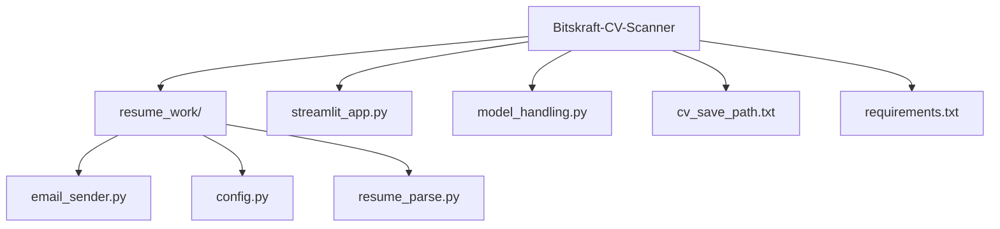

# 📘 User Manual for CV Parsing & Shortlisting System (Bitskraft-CV-Scanner)


## 1. Introduction
The Bitskraft-CV-Scanner is a web-based application designed to help hiring managers and recruiters automatically parse, analyze, and shortlist resumes based on their relevance to a job description. Key features include:

   -  Uploading resumes in PDF or DOCX format
   -  Extracting and cleaning text, optionally via OCR for scanned documents
   -  Computing semantic relevance versus a provided job description using embeddings
   -  Matching important keywords from the job description to the resume
   -  Producing an overall match score, summary (e.g. “Strong Match”, “Needs Improvement”), and list of matched keywords
   -  Providing a simple web interface (via Streamlit or Flask) for uploading, viewing results, and managing shortlists
   -  Sending email notifications to shortlisted candidates directly through Outlook (win32 client).


---

## 2. Architecture & File Structure
Here’s a breakdown of the main directories and files in the GitHub repo, and their responsibilities:


---

## 3. How It Works (User Workflow & Processing Flow)
Here’s a typical flow from uploading a resume to obtaining a shortlist or match score:

**a. User Uploads Resume & Enters Job Description**

Through the web interface (Flask or Streamlit), the user uploads one or more resumes and provides a job description text.

**b. Text Extraction**
- If the resume is text-based (PDF / DOCX), extract text directly.
- If it’s a scanned PDF (no embedded text), apply OCR to extract readable content.
 
**c. Preprocessing**

Clean the extracted text: normalize whitespace, remove punctuation, lowercasing, etc.

**d. Keyword Extraction from Job Description**

Extract important terms/technologies/skills from the job description. This may include tech keywords, proper nouns, etc.

**e. Semantic Similarity Calculation**

Compute embeddings for both the resume text and the job description. Use a SentenceTransformer (or similar) model to measure semantic similarity.

**f. Keyword Matching & Scoring**

Check which of the extracted keywords are present in the resume text. Combine this with the semantic similarity to compute an overall match score.

**g. Result Generation**

Produce a summary of the candidate’s resume with:
- Overall match score
- Semantic relevance component
- A qualitative summary (e.g. “Strong Match”, “Moderate Match”, etc.)

 
**h. Send Emails**

Shortlisted candidates can be notified directly via Outlook from the browser  

---

## 4. Files and Folder Hierarchy
## Project Architecture


## 5. 🛠️ Pre-requisites
   - Python 3.8 or higher
   
   - pip(python package installer)
   
   - Web browser(Chrome,Edge,Safari, etc.)
---

## 6. ⚡ How to start
  **1. Clone the Repository**
  ``` bash
     
     git clone https://github.com/yourusername/Bitskraft-CV-Scanner.git
     
     cd BitsKraft-CV-Scanner
```

  
  **2. Set Up Virtual Environment(Recommended)**
  
  
 **3. Install Dependencies**
``` bash
     cd resume_evaluator

     pip install -r requirements.txt
```


 **4. Run the Application**
```bash
     Streamlit run streamlit_app.py
```

  The application will be available at http://localhost:8500
  ---

  ## 7. 📋 Usage

    1.Access the Application: Open your web browser and navigate to http://localhost:8500
    2.Upload Resume: Click the upload button and select CV files (PDF, DOCX Supported)
    3.Configure Parameters: Set evaluation criteria and preferences
    4.Start Analysis: Click "Analyze" to begin the AI evaluation process
    5.View Results: Review comprehensive analysis reports and scores
    6.Export Reports: Download detailed evaluation reports and record-keeping
    
   ---

  ## 8. 🔧 Configuaration

   Environment Variables

    Create .env file in the resume_evaluator directory:
   

---

  ## 9. Model Configuration

     Customize AI evaluation parameters in model_handling.py :

      - Scoring weights
      - Evaluation criteria
      - Industry-specific requirements
      - Language processing settings

   ---

  ## 10. 📊 Evaluation Criteria

     The AI scanner uses a dual-approach evaluation system based on job requirements you  specify:

     Scoring Methodology

        - Semantic Matching(60%): Advanced AI understanding of context, skills, and experience relevance

        - Keyword Matching(40%): Direct matching of specified job requirements and technical terms

      Evaluation Process

        1.Requirements Input: Enter your specific job requirements, skills and qualifications
        2.Semantic Analysis: AI analyzes the contextual relevance and depth of candidate experience
        3.Keyword Detections: System identifies exact matches for required technical skills and qualifications
        4.Weighted Scoring: Combines both approaches with 60-40 weighting for comprehensive evaluation
        5.Final Score: Generates overall compatibility score with detailed breakdown

      What Gets Evaluated

        - Technical Skills Relevance: How well candidate skills align with job requirements
        - Experience Context: Quality and relevance of work experience (semantic understanding)
        - Requirement Fulfillment: Direct matches for must-have qualifications
        - Skill Depth: AI assessment of expertise level in required areas
        - Industry Alignment: Contextual understanding of industry-specific experience

   ---
   
  ## 11. 🔒 Security & Privacy

       - All uploaded files are processed locally
       - Temporary files are automatically cleaned up
       - No personal data is stored permanently
       - Secure file handling protocols implemented

   ---
       
  ## 12. 🚧 Development

      Adding New Features

       1.Fork the repository
       2.Create a feature branch (git checkout -b feature/new-feature)
       3.Make your changes
       4.Add tests if applicable
       5.Commit your changes (git commit -m 'Add new feature')
       6.Push to the branch (git push origin feature/new-feature)
       7.Create a Pull Request

   ---

 ## 13. Running tests


---


 ## 14. 📦 Dependencies

      Key dependencies include:

        - PyPDF2/pdfplumber: PDF processing
        - python-docx: Word document handling
        - scikit-learn: Machine learning algorithms
        - nltk/spacy: Natural language processing
        - pandas: Data manipulation
        - numpy: Numerical computing
      See requirements.txt for complete list.
   ---

 ## 15. 🐛 Troubleshooting

       Common Issues

       1.File upload Fails

         - Check file size limits (default: 16MB)
         - Ensure supported file format (PDF, DOC, DOCX)
         - Verify upload directory permissions

      2.Analysis not Starting

        - Check AI model dependencies are installed
        - Verify sufficient system memory
        - Review error logs in console

      3.Performance Issues

        - Consider upgrading hardware for large batch processing
        - Optimize model parameters for your use case
        - Check available disk space
---

   ## 16. 📈 Performance

         - Processing Speed: ~2-5 seconds per resume
         - Batch Capacity: Up to 50 resumes simultaneously
         - Accuracy Rate: 85-95% depending on resume quality
         - Supported Formats: PDF, DOC, DOCX
         - Languages: English (primary), expandable
---
  
   ## 17. 🤝 Contributing

       We welcome contributions! Please see our Contributing Guidelines for details on:

         - Code style and standards
         - Pull request process
         - Issue reporting
         - Development setup
   ---

  ## 18. 👥 Team

          Bitskraft Development Team
             - Bijaya Thebe
             - Kushal Sharma
             - Najib Thapa
             - Anugaya Shah

          Visit us at bitskraft.com
          Contact: contact@bitskraft.com
---
  ## 19. 🙏 Acknowledgments

           - Open-source ML libraries and frameworks
           - Resume parsing algorithms research

---
  ## 20. 📞 Support

           For support and questions
           -
---

# Made by the Bitskraft Team  


